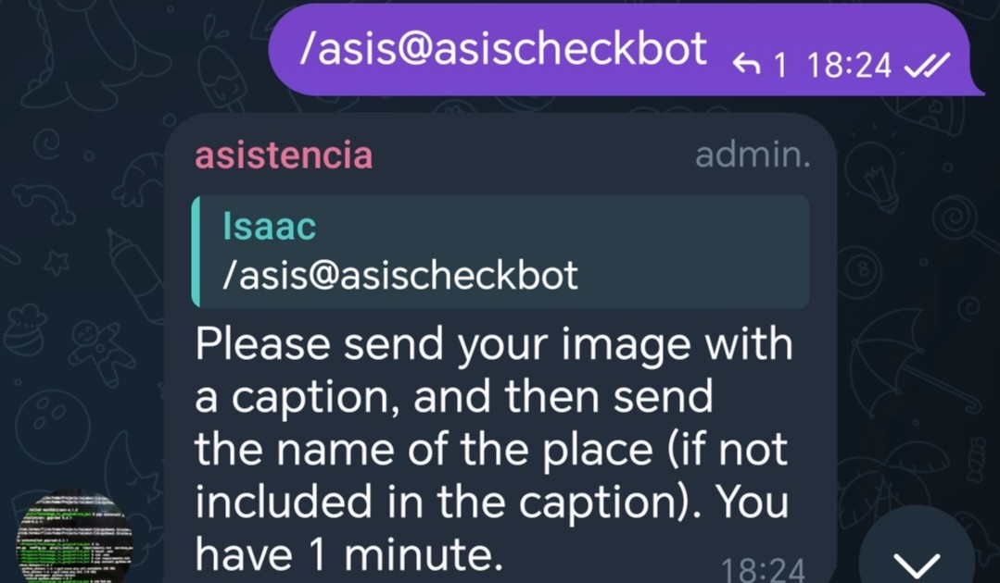

# README for Telegram Bot: /asis and /indicadores Data Collection

## Overview

This Telegram bot helps users submit images and structured data for two interactive commands:

* `/asis` — for sending a photo with an optional caption and a follow-up text (typically a place name or additional info). Data is stored to a Google Sheet.
* `/indicadores` — for sending structured key-value data lines plus multiple files/images related to indicators. Data and files are stored on Google Drive and Google Sheets.

It uses the official `python-telegram-bot` library with async support, and integrates with Google APIs via a custom `google_module`.

---

## Features

### /asis

* Starts a session per user in a chat, valid for 60 seconds.


* User sends a photo with an optional caption.

* User then sends a text (e.g., name of a place).


* If timeout occurs before text is sent, photo and caption are automatically stored.
* Session data includes user info, photo metadata, and follow-up text.
* Stored asynchronously to Google Sheets.


### /indicadores

* Starts a session per user in a chat, valid for 3 minutes.


* User sends structured text data in a fixed format with key\:value lines.


* User can send multiple files or photos.


* Session data (text + files) are saved to Google Drive and Sheets when user sends `/done` or when timeout occurs.


* Validates and parses key\:value format lines.

---


## Setup & Installation

1. Clone this repository.

2. Create a `.env` file with your Telegram bot token:

   ```
   BOT_TOKEN=your_telegram_bot_token_here
   ```

3. Ensure you have the dependencies installed:

   ```bash
   pip install python-telegram-bot dotenv nest_asyncio
   ```

4. The bot depends on a module `google_module.py` which handles the Google Sheets and Drive integration. You must provide this module with at least these functions:

   * `store_to_google_sheet(chat_id, user_record, context)`
   * `store_indicadores_to_drive_and_sheet(chat_id, user_id, session, context)`

   Implement these according to your Google API setup.

---

## Running the Bot

Run the bot script:

```bash
python bot.py
```

The bot will connect to Telegram and start polling for messages.

---

## Usage

* **Start /asis session:** `/asis`
  Follow instructions to send photo and then place name.

* **Start /indicadores session:** `/indicadores`
  Follow instructions to send formatted data, then files. End with `/done` or `/listo`.

* **End /indicadores session manually:** `/done` or `/listo`

---

## Important Details

* Sessions are tracked per chat and user.
* Timeout handlers automatically save and clear sessions to avoid stale data.
* Photo files are downloaded as byte arrays before storing.
* The bot supports multiple concurrent sessions in multiple chats.
* Logs info messages and errors for debugging.

---

## Improvements / Notes

* Session timeouts are fixed (60s for /asis, 180s for /indicadores) but can be adjusted in constants.
* Error handling on data parsing is minimal; malformed input in /indicadores text results in an error message.
* Google API integration must be handled externally and securely.
* Photo and file downloads happen asynchronously and are stored temporarily in memory.

---


